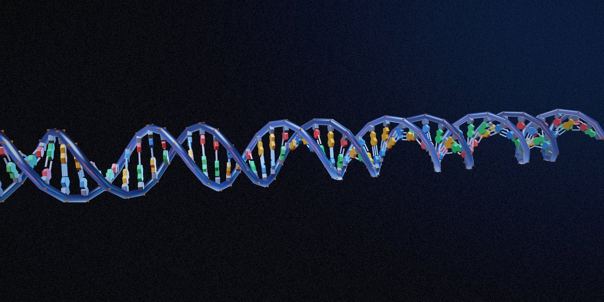
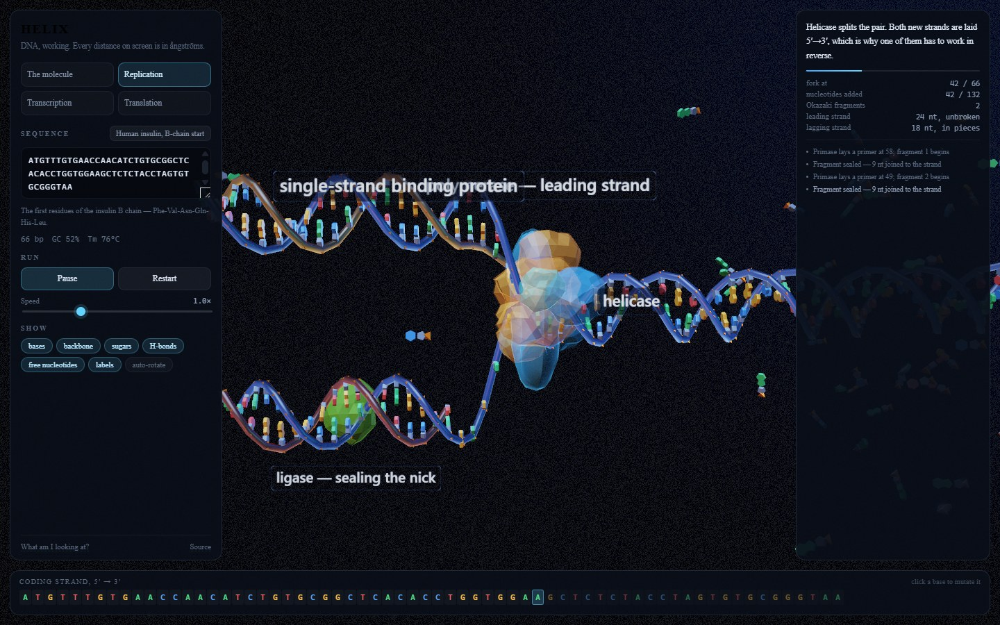
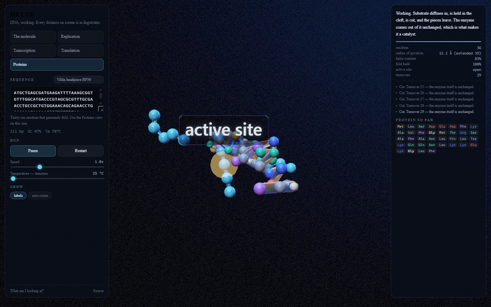

# Helix

An interactive simulation of DNA and the proteins it codes for, in the browser.
The double helix and what heat does to it, a replication fork, a transcription
bubble, a ribosome building a protein, and then that protein folding up and
going to work — all laid out from real molecular geometry, and all driven by a
sequence you can type in and mutate.

No build step, no package manager, no network. Open `index.html` and it runs.



## Running it

```bash
npx -y serve -l 5182 .
```

Any static file server works, and it runs offline. There is one dependency,
`three.module.js`, vendored in `js/lib/`.

## What is on screen

**The molecule.** B-DNA at rest, with a temperature control. The melting is the
part worth playing with: turn the heat up and the molecule does not come apart
evenly. It opens at the ends first, and then wherever the sequence is richest in
A and T, because an A·T pair is held by two hydrogen bonds and a G·C pair by
three. Load the TATA box preset and watch a promoter melt while the GC-rich
flanks stay shut — which is why promoters are AT-rich in the first place.



**Replication.** One fork, two daughter helices. Everything awkward in this
picture follows from a single constraint: polymerase can only add a nucleotide
to a 3′ end. The two templates run in opposite directions, so at a fork moving
one way, only one of them can be copied continuously. The other is copied
backwards in pieces — Okazaki fragments — each started behind the fork and run
away from it until it meets the last one.

**Transcription.** A bubble of about fourteen base pairs travelling along the
molecule, opening ahead of the polymerase and shutting behind it, with the
transcript pushed out through a channel of its own so the DNA can re-form.

**Translation.** The ribosome, three nucleotides at a time. tRNAs arrive at the
A site constantly and nearly all of them are wrong and fall straight back out.
When one pairs, the chain is handed to it and the ribosome steps exactly three
bases. Then the finished chain folds.

**Proteins.** What the chain becomes, and why that matters.



It arrives as a floppy string with no shape and no function. Heat shakes it
through conformations while the greasy residues hold on to whatever brings them
together; the backbone closes into helices wherever the local residues favour
them, and stops at prolines and glycines, which is what those two do in real
proteins. Then a pocket appears on the surface — lined by residues that sit far
apart along the chain and are brought together only by the fold. Nothing
nominates that pocket; it is found by searching the folded geometry for a dent
big enough for the substrate and walled on most sides.

That pocket is the whole job. Substrate diffuses in, is held, is cut, and the
two pieces leave, with the enzyme unchanged — which is what makes it a catalyst
rather than a reagent.

Then push the temperature up. The fold lets go over a narrow range rather than
softening gradually, because it is held by many weak interactions that have to
give way together. The helices unwind, the pocket stops existing, and turnovers
stop dead. Cool it again and it refolds and resumes. Same atoms, same bonds,
same sequence — the only thing that changed is the shape, and the shape was the
mechanism. That is the answer to how a protein works.

Use the villin headpiece preset for this. The other presets code for peptides
of about twenty residues, which is too short to have an inside.

**Mutation.** Click any base in the strip along the bottom to change it. In
translation the readout tells you whether it was silent, missense or nonsense.
The beta-globin preset is set up so that one click at position 20 turns GAG into
GTG, which is sickle-cell disease.

## How it is put together

| File | What it does |
| --- | --- |
| `js/bio.js` | The biology, and nothing else. Helical parameters, base properties, the standard genetic code, amino acid classes, translation, mutation classification. No THREE, no DOM. Every constant carries its source. |
| `js/geometry.js` | Molecular primitives. Purine and pyrimidine ring outlines built at the 1.39 Å aromatic bond length, deoxyribose, phosphate, protein blobs, and `Ribbon` — a tube whose vertices are rewritten each frame instead of reallocated. |
| `js/chain.js` | A strand as data: letters, presence flags, and per-residue frames. Plus the B-DNA placement maths, `facePair`, and hydrogen bond geometry. |
| `js/render.js` | Draws chains. Four instanced meshes and a pool of ribbons; stateless between frames. |
| `js/pool.js` | The free nucleotide pool, its diffusion, and selection by rejection. |
| `js/machines.js` | Helicase, polymerases, ribosome, tRNA, and the smaller proteins. |
| `js/peptide.js` | The chain: hydrophobic collapse, helix formation, and the pocket search. |
| `js/stage.js` | The shared world and the layout conventions every scene obeys. |
| `js/scene-dna.js` | The molecule, and replication. |
| `js/scene-expression.js` | Transcription, and translation. |
| `js/scene-protein.js` | Folding, catalysis, denaturation, and the substrate. |
| `js/post.js` | Bright pass, two blur scales, bloom, ACES, grade, vignette, grain. |
| `js/controls.js`, `js/ui.js`, `js/main.js` | Orbit camera, the panel and sequence strip, and the wiring. |

## What is accurate, and what is not

This matters more than usual for a thing like this, so:

**Accurate.** The helix rises 3.38 Å per base pair and turns 34.3°, giving 10.5
pairs per turn and a 35.5 Å pitch. The two backbones sit 127° apart around the
axis rather than 180°, which is what makes one groove wide and the other narrow
— get that wrong and you lose the whole reason a protein can read a sequence
without opening the helix. That 127° is pinned twice over: it puts the groove
widths in the observed 12 Å : 22 Å ratio, *and* with C1′ atoms on a 5.9 Å radius
it puts them 10.56 Å apart, against a measured 10.5 Å.

Purines are drawn as genuinely fused bicycles and pyrimidines as single rings,
both at the 1.39 Å aromatic bond length, so a purine plate comes out 4.7 Å long
and a pyrimidine 2.65 Å. Nothing imposes a hydrogen bond length anywhere: the
gap between two paired plates is what is left over, 10.56 − 4.7 − 2.65 = 3.2 Å,
against a real Watson-Crick bond of 2.8–2.9 Å. It lands 0.3 Å long because the
plate is drawn from C1′ rather than from the glycosidic nitrogen further in.

Also accurate: two hydrogen bonds on A·T and three on G·C, antiparallel strands,
11° propeller twist, 5′→3′ synthesis and everything that follows from it, the
standard genetic code in full, 3.8 Å between consecutive alpha carbons, the
5.0 Å and 6.2 Å spacings that define an alpha helix, measured side-chain
volumes, Kyte-Doolittle hydropathy, Chou-Fasman helix propensity, and selection
by rejection — wrong nucleotides and wrong tRNAs really do arrive, fail to pair,
and leave.

The sequences are real. The insulin preset translates to the insulin B chain,
the beta-globin preset to MVHLTPEEKSAVTALWGK, and the villin preset to the
36-residue headpiece used as the standard folding benchmark.

**Not accurate.** The proteins are lumpy blobs, not structures; a helicase here
is a ring because it encircles a strand, not because it resembles DnaB.
Timescales are slowed by something like a factor of a million. Okazaki fragments
are 9 bases here and 1,000–2,000 in a bacterium. The transcription bubble
travels at a constant rate instead of stalling and backtracking the way a real
polymerase does.

The folding is the loosest part and is best read as an illustration rather than
a result. It is a hydrophobic collapse with a helix term:

- the chain holds itself at 3.8 Å between consecutive alpha carbons;
- residues cannot overlap, with an allowance for the side chains that a
  Cα-only model does not otherwise have — without it the protein comes out
  about twice as dense as any real one;
- greasy residues attract each other in proportion to the product of their
  Kyte-Doolittle hydropathies;
- the backbone is pulled towards 5.0 Å at i→i+3 and 6.2 Å at i→i+4, weighted by
  Chou-Fasman helix propensity. Those two distances *are* an alpha helix, and
  the weighting is why helices stop at prolines and glycines;
- a thermal term shakes the whole thing, annealed downwards so it starts hot
  enough to leave the extended shape and ends cold enough to keep what it found.

The thermal term is not decoration. A chain extruded straight has every pairwise
force along it collinear, so it is an unstable equilibrium and will stay a rod
for ever no matter how strong the attraction. Something has to break the
symmetry, and in a cell that something is heat.

What it does, measured against villin headpiece HP36 over six runs: mean radius
of gyration 10.6 Å against a real 9.5, mean helix content 69% against a real
~60%, a pocket found every time, and hydrophobic residues buried closer to the
centre than polar ones in every run. Denaturing removes the helices, the pocket
and the catalysis, and cooling restores all three.

It is still not a structure prediction and will not give you the right fold for
any sequence. And on the short presets — around twenty residues — expect a
compact ball rather than a convincing core, because a chain that short has no
inside. That is true of real peptides that short too.

The catalysis has one honest cheat in it. Substrate is confined to a small
volume around the enzyme and is steered towards the mouth of the site when it
gets close. Free diffusion in an open box would essentially never put a
substrate into a pocket 10 Å across, and the scene would show nothing happening.
Real enzymes have the same problem and solve it the same way — charged residues
around the site set up a field that pulls substrate in, which is how the fastest
of them reach the diffusion limit — but the concentrations and rates here are
chosen to be watchable, not measured.

Melting is a window-averaged hydrogen bond count with an end-fraying term, not a
nearest-neighbour thermodynamic model. It gets the behaviour right — ends first,
then AT-rich domains — for the right reason, but the temperatures on the slider
are indicative.

## Controls

Drag to orbit, scroll to zoom, shift-drag or right-drag to pan. Space plays and
pauses, `R` restarts. Click a base in the bottom strip to mutate it.

`?capture` turns on `preserveDrawingBuffer` so stills can be pulled off the
canvas; it costs performance, so leave it off normally. `window.__helix` exposes
`setScene`, `advance(seconds)` and `render()` for driving the thing without a
frame loop.

## Licence

MIT. See [LICENSE](LICENSE).
